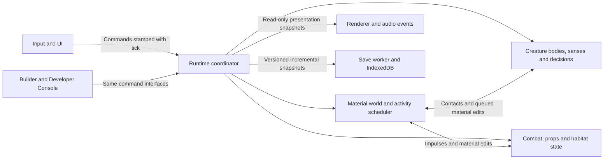

# Alchemist's Descent: The Living Descent

**Engine and game overhaul proposal — 4 September 2026**
**Status: accepted design reference.** The first playable overhaul is implemented on `feat/living-descent`; see [implementation and remaining acceptance gates](living-descent-implementation.md). The review below records the original audited checkout, `db23199bb33df9d706621d85dab0f94de1e70d01` on `main`. Browser-first is the working assumption; target hardware and release scope remain open.

## 1. Recommendation

Rebuild the game around **a living cave that the player can manipulate through chemistry**. Make creatures' bodies, senses, needs, and relationships the central system. Design the caves, spells, lighting, sound, and progression to expose that system.

The current implementation contains considerable useful work: material reactions, seeded simulation streams, a fixed game clock, wand compilation, fluid handling, persistent expeditions, rigid bodies, and particularly the Weaver's surface locomotion. The problem is that their combined experience does not yet deliver the intended fantasy. Further isolated enemy branches and visual effects will encounter the same limits.

Keep TypeScript, Vite, Three.js, Rapier, and the content tools for the first proving slice. Substantially replace the runtime's ownership boundaries, creature architecture, encounter generation, presentation, and player journey. A change of programming language or commercial engine is a separate decision that must earn its cost against the same playable scene.

**First delivery: one excellent 12–15 minute expedition, three fully realized creature species, one coherent visual language, and measured performance.** Expand the game only after this is enjoyable to replay.

## 2. Review scope and baseline

### What was inspected

| Area | Evidence examined |
| --- | --- |
| Runtime and simulation | `Game`, `World`, `Simulation`, camera bounds, fixed-step scheduling, material and electrical update paths |
| Creatures and physics | `Enemies`, `enemyDefs`, `weaverLocomotion`, enemy sprites, player control, entity pools, status contacts, Rapier integration |
| Rendering and assets | `FrameComposer`, `Renderer`, `Lighting`, backgrounds, sprite rigs, post-processing defaults, WebGPU plans and current selection code |
| Game structure | `Levels`, population placement, region/prefab generation, surface introduction, progression pacing, mechanisms, saving |
| Interaction and content | Wand cards/compiler surfaces, flask controls, HUD, launcher, tutorial prompts, Grimoire, input ownership, procedural audio |
| Authoring and delivery | Builder boundaries, campaign versus virtual-world paths, networking plans, build configuration, verification scripts, tests and recent history |

Live inspection covered the production first visit and launcher, a normal D1 start, disposable D1 traversal/casting, the Weaver test lair, Fungal Deep, and Flooded Caverns. Captures include 1440×900 and 1280×720. These were short browser probes, not completion of every biome or a substitute for independent players evaluating fun. Audio implementation was inspected; no subjective listening evaluation is claimed.

### Validation performed

- `npm run build`: **passed**, including TypeScript checking.
- `npm run lint`: **passed**.
- `npm test`: **1,044 passed, 2 failed**, across 90 test files; 219 seconds. Both failures are the prefab generator checks. Regenerating all seven prefabs in an isolated scratch directory proved they match after CRLF normalization. The scripts compare raw text against LF output, so this Windows checkout fails despite matching content. Fix the check and repository line-ending policy; do not change generation to satisfy it.
- Runtime capture script: D1, Weaver, fungal and flooded scenes completed without JavaScript page errors.
- `node scripts/verify-organic-enemy-trio.mjs http://127.0.0.1:5180/`: **14 checks passed**, including growth limits, protected terrain, wet/beached state and charge behavior. These establish existing material interactions, not a verdict on animation quality or fun.
- Stress benchmark: **failed all four existing timing thresholds**; measurements below.
- This checkout initially lacked dependencies. The lockfile install omitted Windows native Rollup/esbuild packages; matching binaries were supplied locally and the remaining dependency tree restored from the lockfile. No package manifest or lockfile change is part of this proposal.

Full campaign completion, the entire browser-probe inventory, integrated-GPU testing, mobile play, multiplayer, and audio listening remain outside this measured baseline.

### Measured performance

Hardware: Ryzen 9 5950X, NVIDIA RTX 3080 Ti through ANGLE/D3D11. Browser: headless Edge 153. Canvas: 1150×782, presenting a 575×391 cell view. Actual backend: WebGL2; existing GPU terrain composition enabled. Tests/build had finished before the stress measurement; unrelated workstation activity was not controlled.

Command: `node scripts/perf-scene.mjs overhaul-audit http://127.0.0.1:5180/ 2 360`

| CPU timing bucket | Mean | p95 | Existing p95 threshold |
| --- | ---: | ---: | ---: |
| Material simulation | 8.98 ms | 12.30 ms | 6 ms |
| Entity/gameplay bucket | 1.42 ms | 2.85 ms | 2.5 ms |
| Composition | 8.37 ms | 16.40 ms | No separate threshold |
| Rendering total | 10.29 ms | 23.80 ms | 5 ms |
| Frame work total | 25.38 ms | 54.20 ms | 25 ms |

There were 723 rendered-frame samples and 709 tick-bearing samples. The synthetic scene includes material chaos, repeated explosions, a mixed enemy group and distant Weavers. CPU buckets are not GPU execution timings, and `1000 / CPU frame work` is not observed FPS. Tick-bearing samples can contain catch-up ticks. This is a stress baseline on one machine, not a production FPS guarantee or an isolated attribution to any one function.

A separate normal D1 session used `run new --seed 777`, then five successful `run save` commands. They took **86.8–109.5 ms**, writing about **2.39 million characters** each. These timings include the console/save path, rather than isolating only storage. An idle five-second D1 cadence sample had a 16.8 ms p95 frame interval but a 150 ms maximum and approximately 55 simulation ticks per second. The short sample demonstrates why average work and p95 alone can miss hitches; it is not a stable gameplay benchmark.

The local, uncompressed production preview transferred **17.42 MB** on first visit, including five backdrop PNGs and a roughly 1.97 MB Grimoire image before opening the book. Hosted compression/cache behavior was not measured. The production player bundle does exclude the Builder; do not confuse remaining Sandbox controls with an accidentally shipped Builder.

Local raw evidence is in `verify-out/overhaul-review/` and `verify-out/perf-overhaul-audit.json`. That directory is intentionally untracked. Useful captures: `11-production-first-visit.png`, `12-production-launcher.png`, `13-production-expedition.png`, `07-weaver-encounter.png`, `08-fungal.png`, and `09-flooded.png`. The durable numerical findings are recorded above so the proposal survives cleanup of those artifacts.

## 3. Why the current game falls short

The evidence column records current behavior. The implication column is the design diagnosis, not a claim that a playtest has proved causation.

| ID / priority | Current evidence | Implication and required change |
| --- | --- | --- |
| F1 / critical | Shared enemy notice uses player distance; generated enemies retain one-way alert, while authored patrols have de-alert behavior. Some individual attacks have line-of-sight checks. [Enemies](../src/entities/Enemies.ts#L2099) | Attack visibility is not a perception model. The player cannot consistently hide, distract, or understand what a creature knows. Introduce sensory observations, uncertain memory, search and disengagement for every species. |
| F2 / critical | Root Loper limb positions use trigonometric animation; Rillback body segments are advanced inside drawing. Most species retain a single rectangular gameplay footprint. Weaver locomotion is a substantial tick-owned exception. [EnemySprites](../src/render/sprites/EnemySprites.ts#L409), [Weaver locomotion](../src/entities/weaverLocomotion.ts#L1) | Visual fluidity often lacks corresponding physical agency. Build authoritative articulated bodies and locomotion controllers; use the Weaver as a starting reference, not a finished generic creature engine. |
| F3 / high | Small prey are explicitly transient, camera-spawned, despawned at distance, and unsaved. Populations use biome weights with habitat/lair special cases. [Critters](../src/game/Critters.ts#L8), [population](../src/game/Levels.ts#L2530) | There are ecological details, but limited persistent ecological consequences. Replace ambient-only prey with bounded habitat populations, feeding relationships, dens and stable identities. Keep purely decorative motes separate. |
| F4 / critical | Material work scans the camera-derived simulation rectangle. Expensive enemy behavior uses related bounds. A full interior window covers up to 663×479 cells before substeps. [Camera](../src/render/Camera.ts#L100), [Simulation](../src/sim/Simulation.ts#L99) | Camera movement influences what is alive and what costs time. Give simulation its own activity scheduler, stable boundaries and explicit offscreen behavior. |
| F5 / critical | Current-level serialization and `JSON.stringify`/`localStorage.setItem` occur synchronously. Real D1 saves measured 87–110 ms. [Levels](../src/game/Levels.ts#L1159) | Saving interrupts play and grows with world state. Use incremental snapshots and asynchronous storage with recoverable commits. |
| F6 / high | The stress script enters a test run before timing `saveExpedition`, which returns without saving in disposable runs. The HUD derives “fps” from CPU work, and the benchmark allows a 25 ms frame-work p95. [benchmark](../scripts/perf-scene.mjs#L62), [save guard](../src/game/Levels.ts#L1163), [PerfHud](../src/ui/PerfHud.ts#L147) | Existing measurements can give false confidence. Repair observability before judging an engine replacement or advertising a frame rate. |
| F7 / high | Captures show mottled terrain, soft overbright emitters, a simple small wizard, and detailed Weaver artwork competing at different visual scales. Low-light limbs and hazards merge into the scene. [FrameComposer](../src/render/FrameComposer.ts), [lighting](../src/render/Lighting.ts), [sprites](../src/render/sprites/EnemySprites.ts) | The image needs art direction and hierarchy. Establish a shared pixel scale, material palette, silhouette rules and restrained lighting before adding effects. |
| F8 / high | Production starts in Sandbox, with a tool palette and parameter panels; Play opens a launcher with expedition and test choices. The in-game HUD exposes two wand grids, four meters, flask slots, objective, minimap and hostile count. [Game](../src/game/Game.ts#L119), [RunLauncher](../src/ui/RunLauncher.ts), [Hud](../src/ui/Hud.ts) | First contact presents a workbench before the adventure. Make a playable expedition the main entrance and progressively disclose specialist information. The hostile count also encourages extermination rather than reading an ecosystem. |
| F9 / high | D1 movement is deliberately scaled to 0.74 horizontally and 0.84 vertically; movement improves with depth. Existing coyote time, buffering, climbing and momentum support are already present. D1 also requires a specific bench lesson before exit. [pacing](../src/config/pacing.ts), [Player](../src/entities/Player.ts#L1433), [gate](../src/game/Levels.ts#L850) | The opening withholds part of the movement feel and uses an inventory action as a progression check. Start with satisfying movement; teach chemistry through a useful encounter rather than mandatory menu compliance. |
| F10 / high | Generated topology/placement has substantial reachability checking, but brief traversal captures still show repeated narrow diagonals, similar material dressing, and many competing bright points. [CaveGenerator](../src/world/CaveGenerator.ts), [biomeExtras](../src/world/biomeExtras.ts) | Reachability does not measure pacing, anticipation or memorable spaces. Generate encounter and habitat structure before decorative density. |
| F11 / medium | The audio API is mainly non-positional tone/noise presets routed to one master gain. Noise bursts allocate buffers and most creature identity comes from shared presets. [AudioEngine](../src/audio/AudioEngine.ts) | Sound cannot yet carry enough information about unseen creatures, contact or space. Add positional event audio, authored creature voices, material impacts and a real mix budget. |
| F12 / medium | `Enemies.ts` has 3,515 lines, `Player.ts` 2,493, `Levels.ts` 3,264, `types.ts` 2,784 and `Builder.ts` 13,735. Several renderer paths and world-generation paths coexist. [architecture](../ARCHITECTURE.md) | File size alone is not a defect; concentrated responsibilities and repeated per-kind state make each overhaul feature harder to isolate. Extract ownership boundaries incrementally and stop opening additional technology fronts. |

## 4. Creative direction: an ecosystem made of alchemy

**Player fantasy:** a small, capable alchemist entering the abandoned organs of an underground refinery. Everything down here has learned to eat, shelter, hunt or breed around its chemistry. You survive by noticing those habits and changing the conditions.

Noita explicitly builds its play around manipulating physical materials; its creator's technical presentation connects simulation and emergent gameplay. That is the reference for consequential chemistry. The Rain World developers' animation presentation is the creature-performance reference. The architecture below is this project's proposed implementation, not a claim to reproduce either game's source code. [Noita](https://noitagame.com/), [Petri Purho's GDC talk](https://www.gdcvault.com/play/1025695/Exploring-the-Tech-and-Design), [Rain World animation talk](https://www.gdcvault.com/play/1023475/Animation-Bootcamp-Rainworld-Animation).

### Three signature situations

1. **The stolen lantern.** A Weaver blocks a wet passage. You splash a glowing reagent onto a loose stone and kick it into a side chamber. Small lantern insects gather; the Weaver follows its food. Burning through the web also works, but creates noise and destroys a route you might use on the return trip.
2. **The living sluice.** Rillbacks occupy a flooded conduit. Opening a reservoir gives them a new route; freezing a narrow surface lets you cross; charging the pool makes their discharge dangerous to every wet body, including yours. A retreating eel carries the disturbance into the next room.
3. **The meal beneath the floor.** A blind Stone Maw follows impacts through rock. You throw rubble to lead it through an ore seam, then crawl over a soft moss shelf to avoid another vibration. The creature has excavated a permanent shortcut without becoming a scripted mining tool.

These situations reuse underlying rules. A lure must work outside the demonstration room, a burning web must release real footing, and a creature must be able to choose a better meal than the player.

### The play loop

Observe a room → infer a creature's intent → choose a route or chemical intervention → improvise when the room changes → recover a reagent, useful spell part or ecological fact → reach a refuge and decide how to descend.

Alternate quiet observation, traversal, short violent commitment, and relief. Early rooms should usually support one primary threat and one secondary complication; difficulty grows through relationships and geometry before raw headcount.

Keep material scars and population state within an expedition. Refuges make short sessions practical. Death should offer a quick, legible return to a known safe place with a bounded recovery cost; the exact penalty is a playtest decision. Across expeditions, retain discoveries and expressive starting options, avoiding a stat grind that repairs deliberately weak starting controls.

### The first 12–15 minutes: The Breathing Works

| Approximate beat | What the player does | What it proves |
| --- | --- | --- |
| 0–1 minute: broken intake | Move immediately, jump a gap, catch a ledge, enter a clearly framed opening | Movement is satisfying before upgrades; the next route is obvious without an objective paragraph |
| 1–3: lantern nursery | Carry light past insects; observe a Weaver pursuing one | Creatures have an existence independent of the player |
| 3–5: blocked sluice | Move water, freeze a crossing, or lure Rillbacks into a side pool | Alchemy changes a situation rather than only dealing damage |
| 5–8: the web gallery | Cross under a resting Weaver; hide, lure, burn or fight | Perception, body language and physical footing compose into multiple valid solutions |
| 8–10: bellows wake | A clearly signaled ventilation cycle changes one connected habitat | The world evolves without demanding a global death timer |
| 10–12: warm refuge | Recover, make one immediately understandable wand change, see a shortcut back | Experimentation has a safe rhythm and exploration leaves a useful trace |
| 12–15: return or descend | Use an earlier intervention to choose between a safer return and a richer descent | The run has a small story created by the player |

The first slice uses Weaver, Rillback and lantern insects. Stone Maw and the other species follow after the slice works. Build the ventilation beat using existing reservoirs, valves, emitters and materials; this proposal does not require a new fluid-pressure solver. Introduce it after the opening is readable, and test whether it adds choices before making it a campaign-wide rhythm.

## 5. Creatures: bodies, senses, decisions, relationships

### A shared creature architecture

Each creature needs five distinct layers:

1. **Body:** authoritative positions, masses, collision shapes, constraints, contact state, grip and damage regions. Start with a small chain of circles/capsules and a bounded constraint solver; retain Rapier for appropriate props and rigid interactions. Prototype how the two exchange impulses before standardizing the solver.
2. **Locomotion:** ground, climbing, swimming, flight, burrowing and recovery controllers. They request reachable contacts and forces. Feet remain planted in world space, limbs lift for a reason, and missing support changes balance. Idle breathing and antenna motion remain cosmetic.
3. **Senses and memory:** occluded sight influenced by light; hearing from physical event sources; substrate vibration for appropriate species; direct material contact. Store last-known position, confidence and age instead of handing every brain the player's current position. Add a coarse scent field only if a specific playable interaction requires it.
4. **Decision-making:** competing needs such as hunger, fear, shelter, curiosity and territorial defense. Evaluate affordable utility scores on staggered ticks, with commitment windows and hysteresis. Expose why a decision won. An alerted creature can investigate the wrong location and eventually give up.
5. **Ecology:** stable identities, home regions, prey/predator relationships, satiation and bounded population schedules. Offscreen rooms advance meaningful abstract state; they do not require every limb or grain to simulate continuously.

Suggested initial rates are 60 Hz bodies/steering, 5–10 Hz near-field perception and 2–5 Hz deliberation. These are tuning proposals. Stagger updates by persistent identity. A short-lived threat response can bypass the normal deliberation cadence. Distant ecology runs at a lower explicit rate with deterministic promotion back into detailed simulation.

### Proposed roster

| Species | Physical identity | Life outside combat | Read and counterplay |
| --- | --- | --- | --- |
| **Weaver** — first slice | Compact articulated body, eight planted legs, wall/ceiling transitions, deliberate leaps, silk tension | Repairs a den, hunts small prey, carries a meal home, retreats when badly hurt | Forelegs feel ahead before advancing; body settles before a leap. Break anchors, manipulate prey/light, hide from sight, or force a bad landing. Preserve and generalize the existing locomotion work. |
| **Rillback** — first slice | Flexible colliding spine; thrust and curvature in water; strained body contractions when beached | Grazes in pools, competes for wet tunnels, seeks shelter when water recedes | Tail stiffens and body brightens before discharge. Drain, divert, freeze or bait; conductivity belongs to the real connected material. |
| **Lantern insects** — first slice | Small bodies with economical wing poses and distinct flock spacing | Feed at growth, gather at useful light, flee pressure and predation | Moving light redistributes the flock, which changes predator movement. Initially promote suitable existing critters rather than adding a parallel ambient system. |
| **Stone Maw** — second slice | Heavy segmented burrower, braced mouth plates, body shortening as it bites | Follows vibration and food-bearing seams; sleeps in excavated pockets | Tremors and displaced grit precede emergence. Quiet footing, thrown debris and protected materials alter its route. Tunnel geometry and consumed terrain persist. |
| **Root Loper** — second slice | Long gripping arms pulling a suspended body between growth patches; actual contact constraints | Tends/grazes a grove; avoids dry exposed stone; protects a root bed | Arms test a new hold before shifting weight. Irrigation can create a passage; fire causes a dangerous, costly panic rather than a universal free kill. |
| **Bellows Grazer** — later candidate | Broad soft body with two compressible air sacs and short bracing limbs | Seeks warm vents, eats mineral crust, is usually indifferent to the alchemist | Inflation predicts a gust/steam release. Cool a vent, steer it with warmth or shelter behind its bulk. It earns inclusion only if it adds a distinct interaction. |

Retire generic slime/imp/bomber variants from the new opening roster. Existing kinds remain loadable for old saves, Sandbox and legacy content. Convert the remainder only when each earns a distinct role; do not manufacture sixteen superficially different replacements at once.

### Physical combat and fairness

- An attack has visible preparation, a committed trajectory, a contact window and recovery. Damage follows the attacking body part or projectile, with terrain occlusion; it is not an unrelated distance check.
- Ordinary body overlap causes a shove or grapple according to species. Reserve damage for readable actions and hazardous anatomy.
- Use injury to affect grip, balance or confidence before adding limb dismemberment. Never let a procedural solver make an attack unreadable or unblockable.
- Surface changes invalidate contacts. A foot cannot remain planted in burned-away vines; a swimming tail cannot pass through rock because it is “only animation.”
- Allow escape and avoidance to count as successful play. Essential progression cannot depend on a surviving creature choosing a particular action.

Acceptance clips must show the same creature resting, observing, travelling, attacking, losing support, being injured, fleeing, and recovering. Test slopes, ceilings, narrow tunnels, liquids, moving props, destroyed footing and offscreen return. Attractive motion on a flat test floor is insufficient.

## 6. Player, weapons and progression

Keep the existing buffered jump, coyote time, momentum, climbing and material contact knowledge. Replace overlapping tuning layers with a documented controller whose starting response is already the intended response. Remove depth-based suppression of basic movement in the new slice; upgrades add options, not relief from sluggishness.

Use controlled kinematic movement for the player with physically responsive presentation. The player should remain precise even while creatures stumble and recover. Separate collision clearance, articulated pose and camera composition. Keep high-refresh interpolation visual so it cannot alter simulation outcomes.

Start with a small chemistry toolkit: a reliable impulse/casting tool, access to an ignition effect, and a water flask. Make each useful in traversal, defense and interaction. Preserve wand composition, but organize initial discoveries around a few readable verbs: **push, ignite, wet, freeze, conduct, excavate**. Powerful combinations remain dangerous through physical consequences; avoid compensating for poor readability with high HP and long fights.

The first wand upgrade should visibly change the next cast within seconds. The bench can remain safely pausable, but mandatory card placement should not be a hidden key to the exit. Later progression gives new interactions, specialized tools and knowledge of habitats. It should not turn ecology back into a sequence of damage checks.

Rationalize controls into movement/jump/grip, active tool, flask, and contextual interaction. Keep expert bindings available and remappable. Do not stack a new mechanic onto another obscure letter key. Design a controller mapping alongside this interaction pass; touch delivery is a separate scope decision.

## 7. Visual and sound direction

**Direction: subterranean natural history inside a corroded alchemical machine.** Soot-black structures, mineral chalk, wet slate, oxidized copper and localized biological light. Quiet shapes carry the world; movement and chemical reactions provide the spectacle. This is a proposed art direction, not a replacement of the existing canonical design file yet.

| Layer | Overhaul requirement |
| --- | --- |
| Composition | Design clear foreground, playable middle plane and distant architecture. Use large recognizable structures and areas of rest. The player and an approaching threat must remain legible together. |
| Pixel language | Establish one intended pixel density and palette discipline for terrain, creatures, props and effects. Re-author mismatched assets; do not upscale detailed cutouts beside tiny symbolic sprites and call the mixture finished. |
| Materials | Replace uniform visual noise with coherent clusters, fractures, wet edges, soot and deposition. Every material family needs a readable shape/motion cue as well as a color. |
| Creatures | Prioritize silhouette, weight transfer and expressive gaze over tiny surface detail. Anchor highlights to anatomy; reserve emission for genuinely luminous organs and charge tells. |
| Lighting | Preserve useful shadowing, provide a readable minimum for necessary surfaces, and prevent small emitters from bleaching bodies into white/cyan blobs. Keep background contrast below the action plane. |
| Fluids and effects | Surface ripples, restrained refraction, menisci, splashes and steam should communicate state changes. Separate decorative GPU particles from particles that can become real material. |
| Camera | Add deliberate look-ahead and room framing; preserve aim consistency and show landing destinations. Remove unrequested idle zoom from the baseline, then test it as an option. Camera framing never defines simulation truth. |
| Post-processing | Disable routine chromatic aberration; reduce grain and bloom to a deliberate supporting role. Impacts can briefly change presentation without obscuring hazards or input feedback. |
| HUD and entry | Present Continue / Begin Descent immediately, with Sandbox and Builder under a workshop entry. Show active tool, health and relevant resource state; move the second wand grid and persistent help into intentional interactions. Replace global hostile counting with useful local information. |
| Accessibility | Remappable controls, scalable text/HUD, adjustable shake/flash, color-plus-shape material cues, optional creature-sound captions, and a high-readability lighting mode. Check 720p and common desktop aspect ratios before adding mobile scope. |

The first biome should be recognizable from an unlit silhouette. The second should change spatial forms and ecology as well as its tint. Ship an authored art benchmark room before regenerating an entire campaign around the new style.

Sound must become part of perception: distinguish leg taps, wet tail movement, a sac inhaling, stone chewing and a den alarm before the source is visible. Introduce positional event records, distance/occlusion filtering, material-specific impact layers and reusable audio buffers. Start with separate ambience, creature, player, reaction and interface buses, plus explicit voice limits and priority/ducking. Music follows exploration and threat pressure with quiet space between peaks. This needs an actual listening pass and authored audio work, not only more oscillator presets.

## 8. Engine overhaul

### Ownership model

Keep `Ctx` as the composition seam while introducing narrower interfaces underneath it. Move behavior state out of the renderer; drawing consumes pose snapshots. Separate persistent creature state, per-tick observations, transient attack state and presentation data. Keep shared arrays stable through adapters until all consumers migrate.

The existing frame order is a contract. First record it with replay fixtures. Introduce named phases and explicit command buffers without changing order; move a phase only in a separately reviewed change with measured behavioral consequences. The present 60 Hz accumulator is already implemented and should be retained. Add previous/current poses and interpolation, plus counters for catch-up and discarded time.

### Material activity and navigation

Start with activity metadata over the existing flat world arrays; physical streaming can come later. Prototype 64×64 activity chunks with dirty rectangles, neighboring halos, quiescence counters and scheduled wakeups. Sleeping material must wake for incoming flow, ignition, electrical changes, emitters, body contacts and delayed reactions. A static-looking wet/electrical region is not necessarily quiescent.

Centralize runtime world writes behind mutation helpers and bulk transactions. A write publishes the affected bounds to rendering, lighting, body contacts, navigation and save tracking. Audit direct typed-array writes before relying on dirty tracking. Generation uses explicit bulk initialization rather than thousands of individually dispatched events.

Activation follows players, active events and connected material consequences. The camera is a consumer. Nearby rooms simulate fully; connected but distant habitats retain coarse ecological state; sleeping regions retain snapshots and pending consequences. Bound the cascade frontier while preserving mass and interactions across chunk seams. Changes to traversal order require deterministic tests and an explicit simulation-version policy; do not assume the old whole-window hashes will remain equal by accident.

Build navigation from region connections and local surface/clearance information, with locomotion-specific edges for climbing, swimming, jumping and burrowing. Invalidate only changed regions after destruction. A stale route must produce a safe wait or local recovery, not teleportation or repeated full-map searches. Keep a capped local fallback while a route rebuild is pending.

### Threads and rendering

First make the runtime headless and remove expensive full-window scans, redundant uploads and repeated work. Then benchmark moving authoritative simulation into one worker. Keep all tightly coupled material/body systems under that single owner initially. Send bounded input commands in and reusable presentation buffers out; do not structured-clone the entire world every frame.

Use transferable double/triple buffers as the first transport. Shared memory is an optional measured upgrade: `SharedArrayBuffer` requires the appropriate cross-origin-isolated context, which affects hosting and embedded resources. Worker rendering through `OffscreenCanvas` is another option after measuring transport and latency; it is not a prerequisite for the new creatures. [MDN: cross-origin isolation](https://developer.mozilla.org/en-US/docs/Web/API/Window/crossOriginIsolated), [MDN: OffscreenCanvas](https://developer.mozilla.org/en-US/docs/Web/API/OffscreenCanvas).

Retain the current WebGL2 GPU terrain compositor as the comparison backend. Move batched creature geometry, sprite instances and decorative particles into an efficient presentation path. Cache static terrain/material inputs by dirty region, update lighting according to real invalidation, and keep intermediate effects GPU-resident where practical. Test image parity and contact alignment across camera movement and zoom.

WebGPU remains an optional backend until the complete scene passes capability, device-loss, visual and performance checks. Its current browser availability still warrants explicit support detection. A faster compose fixture is not evidence that material simulation or the complete game is faster. [MDN: WebGPU](https://developer.mozilla.org/en-US/docs/Web/API/WebGPU_API), [existing migration status](WEBGPU-TSL-COMPUTE-IMPLEMENTATION-PLAN.md).

### Saving and identity

Replace whole-expedition synchronous writes with dirty chunk/entity snapshots and asynchronous IndexedDB commits. Compression/encoding runs off the main thread. Track generation numbers so late writes cannot overwrite a newer save; commit a small manifest only when all referenced data is durable. Keep the previous complete generation for recovery.

Import legacy saves once into a versioned runtime schema. Preserve original saves until the new save has been written and read back successfully. Persist stable creature IDs, required body state, needs, den/relationship state and deterministic RNG state; reconstruct purely visual caches. Report quota/failure to the player rather than silently implying persistence succeeded. Test interruption during save, migration, death recovery and multi-tab ownership.

Retain append-only cell and marker contracts. World-generation changes update golden expectations and `GEN_VERSION`; entity/save schema changes need their own versioning. Keep Sandbox grids, Builder documents and expedition saves separate. Multiplayer determinism must not be claimed from seeded cell replay alone: input order, stable IDs, simulation scheduling and presentation independence all matter.

## 9. Performance targets and proof

These are proposed engineering gates, not achieved performance. Choose a named integrated-GPU laptop as the minimum target and a desktop reference machine before implementation; this audit measured only the desktop above.

| Work category | Initial planning budget |
| --- | ---: |
| Active material simulation | 4 ms CPU per fixed tick |
| Creature bodies, perception and decisions | 2 ms CPU per fixed tick |
| Other gameplay and props | 1.5 ms CPU per fixed tick |
| Render preparation and submission | 3 ms CPU per presented frame |
| UI and event dispatch | 0.5 ms CPU per presented frame |
| GPU execution | 6 ms, measured separately where supported |

CPU and GPU can overlap; these allocations are not a formula that proves 60 FPS. Validate the whole scene: at 60 Hz presentation, target p95 frame intervals at or below 18 ms, p99 at or below 25 ms, and no routine save/generation frame over 50 ms. In a steady 60-second normal-speed run, simulate at least 59 ticks per second on average without growing or silently discarded debt. High-refresh displays must produce the same simulation speed and input results.

Record interval histograms, long tasks, allocation/GC pressure, CPU subsystems, actual backend, GPU timing where available, live population/activity counts, tick debt and save costs. Record cold-load transfer and interaction readiness separately. Set initial-load and memory ceilings after selecting target hardware; immediately defer the unopened Grimoire and nonessential biome assets.

Use a small replayable benchmark set:

- Quiet traversal through a real campaign room.
- A dense creature scene with six articulated creatures and a bounded prey flock.
- Destructive chemistry with fire, liquids, electricity, projectiles and debris.
- Removing terrain under planted feet and replanning routes.
- Entering/leaving an active habitat and restoring a saved expedition.
- A 20-minute repeated traversal/transition run for memory growth and ecological stability.

Declare populations, material activity and expected behaviors for each scene so an apparent optimization cannot pass by quietly culling creatures or skipping simulation. Compare identical seeds/input recordings on both reference machines. Keep gameplay-material particles authoritative even when decorative effects are reduced.

## 10. Delivery sequence

| Milestone | Concrete delivery | Exit gate |
| --- | --- | --- |
| **M0 — Trust the baseline** | Repair frame/FPS/save measurements and line-ending-sensitive checks; record replayable scenes, reference hardware and a current player baseline | Timing reflects real intervals and real save writes. Baseline results and limitations are reproducible. |
| **M1 — A body worth controlling** | Starting player movement, tick-owned presentation, narrow runtime interfaces, one generalized Weaver/body prototype | Movement course feels good immediately; the creature grips, loses support and recovers across representative geometry. Rendering frequency cannot alter gameplay. |
| **M2 — A room that lives** | Weaver, Rillback and lantern-insect bodies/senses/needs; persistent habitat state; local navigation invalidation | With the player stationary or absent, feeding and shelter behavior occurs. Hiding/luring/terrain intervention work through shared rules and creatures can disengage. |
| **M3 — The Breathing Works** | Six to eight authored encounter spaces, opening/refuge/return loop, coherent art benchmark, player-facing entry/HUD and positional audio | A complete 12–15 minute expedition is understandable and rewarding without debug tools. Multiple approaches work. First art/audio and human-play gates pass. |
| **M4 — Scale the proven game** | Activity scheduling, rendering batches, asynchronous saves, measured worker migration if beneficial; integrate the slice with seeded generation | Both target machines pass performance gates; save/reload and offscreen promotion preserve ecology and material state. No expansion while routine hitches remain. |
| **M5 — Campaign conversion** | Stone Maw/Root Loper and earned additions, habitat-based worldgen, biome visual identities, revised rewards/bosses, migration and accessibility | The same interaction quality survives a complete expedition. Old supported data loads, tools remain useful and the production path is validated. |

Begin profiling and the save fix in M0/M1; M4 is the scale completion gate, not permission to ignore performance until late. Art, sound and encounter work should begin with the body prototype rather than waiting for a technically “complete” engine.

For planning, treat M0–M3 as roughly **6–10 weeks** for two experienced engine/gameplay developers with consistent art/design support and scheduled audio work. A full campaign conversion is a multi-month project. These are rough scope estimates, not staffing facts or delivery commitments; re-estimate after M1 exposes creature and content throughput. A solo effort should expect a materially longer timeline.

### The human gate

Use at least five players unfamiliar with the current build and compare with a short baseline session. Record behavior and brief interviews, not just completion:

- At least four identify the first meaningful route without verbal coaching.
- At least four can explain what alerted one creature and name a way to avoid or distract it.
- Across the group, at least three materially different solutions to the same encounter occur without hints.
- Most voluntarily choose another attempt, and can describe a moment they caused rather than merely endured.
- Observe deaths, stalls, unused tools and confused inputs; tune from those events rather than treating a tiny sample as statistical proof.

If M3 looks better but people still do not want another run, revise encounter incentives, movement or pacing before expanding the campaign. Passing simulation tests cannot waive this gate.

## 11. Initial implementation backlog

| Ticket | Work and likely files | Required proof |
| --- | --- | --- |
| **OVR-01** | Real cadence/tick-debt metrics and a valid save benchmark: `Game.ts`, `PerfHud.ts`, `perf-scene.mjs`, `perf-harness.mjs` | Known-duration replay distinguishes CPU work, presentation intervals and simulation ticks; a save sample proves nonempty persistence |
| **OVR-02** | Normalize generator checks / define line-ending policy: generator scripts, prefab tests, `.gitattributes` if appropriate | All seven files compare correctly in LF and CRLF checkouts, without changing generated content |
| **OVR-03** | Extract creature state/pose boundaries; migrate drawing-side Rillback/slime/body animation into fixed ticks | Identical gameplay state at 30/60/144 Hz presentation; no draw call mutates authoritative creature state |
| **OVR-04** | Movement benchmark course and coherent starting controller: `Player.ts`, `pacing.ts`, input/camera modules | Run, short hop, ledge catch, crawl, swim and recover from knockback predictably with the initial loadout |
| **OVR-05** | Introduce narrow `src/creatures/` body, senses, memory, brain and locomotion modules; adapt existing `enemyCtl` | Weaver prototype traverses a bounded geometry suite; blocked vision and last-known-position search behave consistently |
| **OVR-06** | Habitat registry and persistent small prey; adapt `Critters.ts`, `Levels.ts`, runtime snapshots and population generation | Feeding, displacement, death, leaving and returning have consistent consequences; promotion creates no duplicate bodies |
| **OVR-07** | Author the art/encounter benchmark in the existing Builder; create compatible creature/environment assets and sound events | Comparable gameplay captures, silhouette checks, audio listening, three successful approaches to the same room |
| **OVR-08** | World mutation/change tracking, activity-chunk prototype and incremental navigation | Mass/reaction tests at chunk seams, delayed wakeups, destroyed support, deterministic replay and performance comparisons |
| **OVR-09** | Incremental asynchronous saves with manifest, recovery and old-save import | Reload and interruption tests preserve world/entity state; foreground save work meets the declared hitch budget |
| **OVR-10** | Production expedition entry, contextual HUD/tutorials and first complete slice | Fresh browser reaches play directly; 720p input/readability checks; M3 human gate |

OVR-01/02 establish measurements. OVR-03/04/05 establish the first playable body. OVR-06/07/10 deliver the slice. OVR-08/09 begin as soon as their ownership seams exist and finish before scale expansion. Split these into focused PRs; do not submit the whole engine as one unreviewable change.

## 12. Migration boundaries and decisions to defer

- Keep the current game playable behind an explicit development flag while building the slice. A rollback must also preserve the last readable save generation.
- Retain Builder, prefab generators, region validation and console workflows. Add a creature lab showing observations, chosen intent, contacts, route and cost. Do not rebuild the large editor as a prerequisite to testing one creature.
- Preserve old enemy IDs and material contracts through adapters. Deprecating an encounter roster does not authorize breaking old documents or saves.
- Reconcile this proposal with `docs/DESIGN.md` before implementation changes become the new authority. That document still describes breakable-well progression, while the live game uses keyed portals and a D1 bench gate. Record the chosen final loop explicitly.
- Pause further multiplayer expansion, infinite-world promotion, extra renderer backends, broad card/material additions and boss accumulation until the slice proves the core. Existing functionality and data remain available during migration.
- Revisit a native engine only if the named browser target misses the agreed scene budget after measured changes, or desktop-only capabilities become a product requirement. Compare development cost, content/Builder migration, input latency, distribution and the same playable scene; do not decide from isolated shader benchmarks.

The immediate decision is to fund **a compelling small game with a reusable creature foundation**. The larger engine earns its shape by making that game work, then carrying its quality across the descent.
