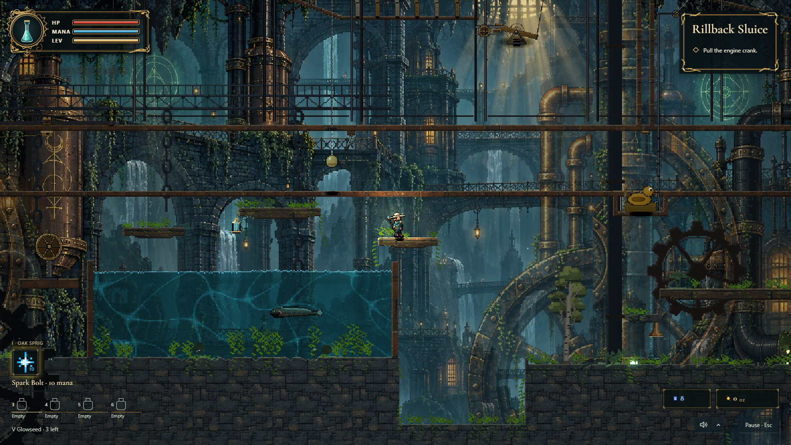

# Opponent and visual polish

Implemented against `855f5ef`, the merged opponent-AI review fixes. No level geometry, cell IDs, save formats or generation version changed.

## Opponent behavior

Bots predict incoming projectile gravity and lifetime from delayed observations, including airborne evasions with a configurable levitation reserve. Firing checks the actual thrown arc and thin cover. Movement checks the whole body corridor and the eventual standing pose after a drop.

Small hazards beside cover use a checked rise-and-cross lane. The lift is limited by fuel, the overhead body corridor must fit, and the descent must reach safe support. A broad patch prompts backward ground movement instead of waiting for the stuck timeout. A bot caught in newly created fire can leave along decreasing exposure. Fighter playbooks, personality, difficulty and keyboard handoff retain their existing controls.

## Visual treatment

The Bellows, Rot Gardens, Sunken Cistern and Kiln Heart use richer distant architecture. Their existing parallax planes, shafts, foreground silhouettes and biome palettes remain layered around it. Clear water refracts those planes, with animated caustics and surface glints. Brass lanterns decorate authored lantern lights. Fine material edges, kelp, moss and ivy attach to current cells and disappear when their water or supporting terrain changes. Actors and interactive glyphs draw above this detail.

The HUD uses original SVG brass frames and a glass-vial badge. Existing resources, equipment, bindings, objectives and treasure values drive it. Touch layouts and larger text remain supported.

Captured from the running game after the final playtests:



`src/config/visualFidelity.ts` holds presentation controls. `?fidelity=0` disables the new detail overlays and lamp gain for comparisons; it retains the new plates, water palette and HUD. It is not a complete old-art preset.

## Art provenance

Four plates were generated with OpenAI image generation using the supplied waterworks references and existing project art for direction. The machinery edit preserves the old transparent composition and physical extent. PNG source captures were converted to WebP with Sharp; the shipped files total 1,850,244 bytes:

- `refinery-waterworks.webp`, 1672 x 941
- `rot-gardens-rich.webp`, 1672 x 941
- `kiln-heart-rich.webp`, 1672 x 941
- `refinery-machinery-rich.webp`, 1150 x 782, transparent

These are distant scenery. They add no walkable surfaces, enemies or pickups. HUD SVGs and cell-based dressing are authored in source.

## Reproducing validation

Start Vite in this checkout, then run:

```sh
npm run typecheck
npm test
npm run build
npm run lint
node scripts/verify-ai-basic.mjs http://127.0.0.1:5182/ --seeds 3 --shots
node scripts/verify-ai-combat.mjs http://127.0.0.1:5182/ --seeds 3
node scripts/verify-visual-fidelity.mjs http://127.0.0.1:5182/
node scripts/verify-mobile.mjs http://127.0.0.1:5182/
node scripts/probe-fidelity-parity.mjs http://127.0.0.1:5182/
node scripts/probe-fidelity-parity.mjs "http://127.0.0.1:5182/?renderBackend=webgpu&enableWebGpuLiveCompose=1"
node scripts/perf-scene.mjs polish http://127.0.0.1:5182/ 1 700
```

Evidence goes to ignored `verify-out/`. Combat verification includes an eight-second normal-clock duel and a canvas recording, `ai-combat/live-duel.webm`. Visual verification captures six real generated floors, edits the underlying water and roots, checks darkness, plays through six seconds of native keyboard movement in the sluice, compares detail cost in one session, and exercises desktop, text scaling and touch layouts.

## Acceptance and limits

- All 30 roster waves cleared; the longest period without input was 41 ticks. All 15 seeded duels resolved inside 60 seconds. The wave and combat probes passed 34 and 58 checks respectively. Focused regressions were run failing before their fixes.
- The final suite passed 3,104 tests in 244 files, along with typecheck, build and lint. Mobile gameplay passed 38 checks. The visual probe passed 27 checks. Native sluice play advanced 364 ticks in six seconds and moved the player 205 cells. Cached detail reduced its additional median composition cost from about 4.7 ms to 2.3 ms in the final pool scene.
- The clear-water probe compares consecutive warm frames at classic resolution. Decimal plate scales previously disagreed at exact texel boundaries; CPU, GLSL and WGSL now share the same small rounding bias. Fine WebGL presentation retains continuous backdrop sampling.
- The final 700-frame chaos run measured 17.70 ms frame p95, below the existing 25 ms frame budget. Its render p95 was 13.34 ms versus 9.14 ms on the unchanged base. The old 5 ms render threshold fails on both revisions; the richer scene does cost more. Simulation and entity thresholds passed in the final run.
- Focused clear-water verification passed in actual WebGL2 and WebGPU backends. Both compared over 64,000 water pixels, with no difference larger than one color step. The WebGPU bridge reported `validated`.
- The older whole-scene WebGL composition probe fails on the unchanged base too, including a drifting classic fixture. The broad WebGPU probe also reports a stale toggle-label expectation and whole-scene differences. These checks are not reported as green. The focused clear-water probes exercise the presentation changed here with ready assets and a deterministic warm frame.

The new art follows the references' architecture, water, vegetation, lighting and brass treatment. Gameplay still uses the existing falling-sand materials and generated level shapes; it is not a reproduction of one fixed reference picture. No public deployment is part of this pass.
