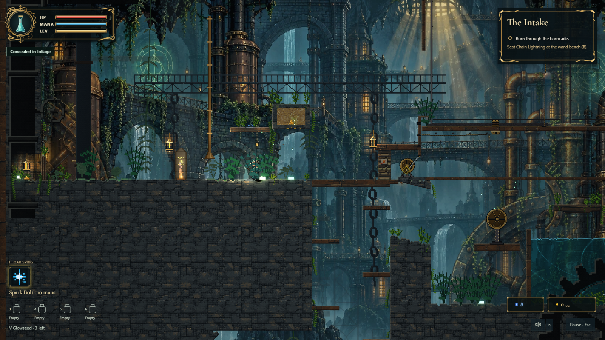

# Foreground foliage and concealment

Some supported moss patches grow tall, dark teal fronds in front of actors.
The shorter, warmer green plants stay behind them. The foreground colour and
height remain the same whether the player is approaching, moving through, or
hiding in the clump, so its depth is readable before contact.

Stand still inside enough of the dark canopy for half a second to hide.
The HUD changes from `Keep still to hide` through `Settling into cover` to
`Concealed in foliage`. Walking or jumping out of the canopy exposes the player.
Casting, kicking, pouring or throwing a flask, taking a stagger, and burning
reveal the player. An attack delays re-entry into concealment for 1.5 seconds,
followed by the normal half-second settling time.

Creature sight loses the player's position, including the lantern's exact
tracking fix and a boss's lair watch. Creatures retain their last sighting and
can investigate sounds. Close contact reveals the player; a creature separated
by solid terrain does not cancel concealment merely by being nearby. Stone Maws
retain their existing short-range vibration sense. Cover does not grant damage
immunity or stop an attack already in flight. Arena rivals do not use this
expedition hiding mechanic.

## Material and rendering contracts

- The roots remain existing `Cell.Moss` with their existing saved life values.
  A stable spatial hash selects foreground patches. No cell placement, save
  layout, or generation version changes.
- Foreground crowns are 28–36 cells tall, with five fronds and wider leaves.
  The same bent geometry drives rendering, heat contact and canopy coverage.
- Nine torso samples measure canopy overlap. At least 55% coverage is required.
  Burning plants, plants charred by 30% or more, and unsupported roots provide
  no concealment. Removing roots cancels it on the next simulation tick.
- `FoliageCover` runs after player movement and before creature perception.
  It reads nearby roots independently of the camera. Grounded state and actual
  displacement handle the physics engine's sub-cell gravity accumulator.
- Foreground foliage draws after actors through the shared pixel overlay used
  by CPU, WebGL and WebGPU. Terrain and pickup/control glyphs stay clear.
  Cosmetic detail switches cannot turn functional cover invisible.
- Concealment is transient and resets on death or level changes. Material
  charring continues to use the saved life plane.

Tuning lives in `src/config/foliage.ts`. The cover API lives on `Ctx`; gameplay
does not manipulate the HUD DOM.

## Reproducing the playtest

Use a freshly started Vite server. `node scripts/verify-foliage-cover.mjs
http://127.0.0.1:5187/` walks into a naturally generated Intake clump with native
keyboard input, waits for the HUD state, exercises real creature perception,
fires the wand with native mouse input and removes the actual roots. Captures,
a recording and measured results go to `verify-out/foliage-cover/`.

Unit tests also cover charring, burning, support removal, camera independence,
grounded gravity accumulation, close contact through terrain, level/death/arena
resets, foreground occlusion and the lantern tracking path.

The integrated change passes typechecking, ESLint, the production build and
3,163 tests across 248 files. The native cover probe passes eight checks. Add
`?renderBackend=webgpu&enableWebGpuLiveCompose=1` to exercise WebGPU; that run
also asserts the actual renderer and validated live-composition bridge, passes
all nine checks, and writes into `verify-out/foliage-cover-webgpu/`.

The living-foliage traversal probe now waits for actual simulation ticks
instead of assuming that 2.4 seconds of video recording contains 90 ticks.
Run performance probes alone to avoid measuring competing browser workloads.
The final six-floor visual/HUD audit passes 27 checks, and living foliage passes
15 checks including material persistence and the corrected native traversal.
In the isolated visual audit, cosmetic detail adds 2.81 ms to median frame
composition (10.82 ms off, 13.63 ms on). This is a local fixture measurement,
not a claim that the separate whole-scene performance budgets pass.

The separate 700-frame chaos benchmark failed its current budgets on this
machine: simulation p95 1.52 ms, entities 2.64 ms, rendering 38.27 ms and whole
frame 56.22 ms. There were no runtime page exceptions. The harness logged a
Vite websocket diagnostic while deliberately blocking the development socket.
Its automatic comparison file dates from July and is not a valid baseline
for this change.

A fresh isolated checkout of the pre-cover revision `962311f`, using the same
700-frame command and machine, also failed rendering and whole-frame budgets:
render p95 38.45 ms and frame p95 56.93 ms. Median composition increased from
13.12 ms to 14.49 ms with cover; entities p95 increased from 2.49 ms to 2.64 ms,
just over its 2.5 ms threshold. These single runs establish a remaining
performance problem and a measurable cover cost; they do not establish a
performance improvement. Profiling composition and upload spikes remains a
follow-up before claiming the stress budgets pass.
