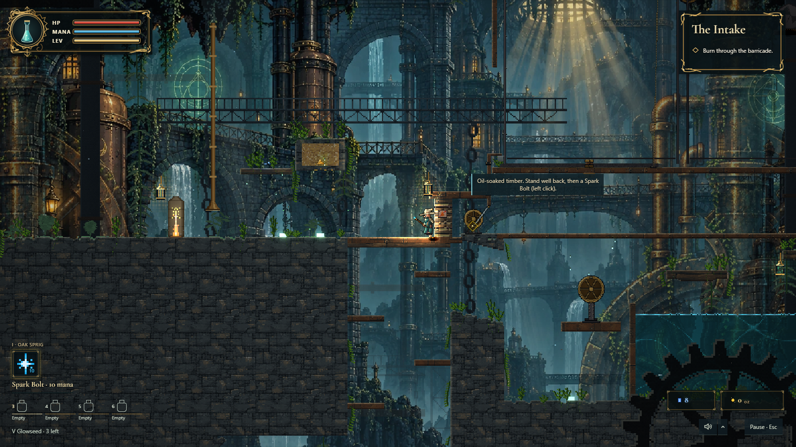

# Living foliage and machinery

Moss crowns part around the player's swept body, keep momentum and settle with damped springs. Enemies brush them too, and submerged fronds follow water flow. The leaves drawn and the leaves touched by heat use the same geometry. The roots are real `Cell.Moss`; existing `Cell.Vines` supply hanging soft strands, cutting, collision, settling and saves.

A deterministic dressing pass adds moss along supported surfaces and separated vine clusters in the Bellows, gardens and waterworks. Dry floors receive fewer moss patches. It uses a separate spatial hash, preserves solid cells and leaves clearance around controls, pickups, camps and gates.

Added damp foliage smoulders, chars, quenches and leaves ash. It inherits at most five ticks of transmission fuel, spends energy at every hop and emits its actual flame once. Its later sparks are cosmetic. Ordinary puzzle moss and vines retain their existing combustion. Burn age and fuel use the existing signed life plane, including lifted-vine snapshots.

Existing procedural cogs rotate slowly and chain links sway between fixed attachments. Near parallax planes and foreground silhouettes retain their palettes and lighting. Only moving pieces are painted; stationary rectangles and row spans are cached. WebGL and WebGPU update existing textures instead of recreating them for each pose. Root discovery reuses the simulation's sorted growth index. Authored lantern glass and flame flicker irregularly in presentation; gameplay light queries keep their original field.

`GEN_VERSION` is 66, and all changed generation snapshots are recorded. Older expedition snapshots follow the game's existing generation-version retirement rule. Cell IDs and save layouts are unchanged.

## Verification

Start Vite in this checkout and run:

```sh
npm run typecheck
npm test
npm run lint
npm run build
node scripts/verify-living-foliage.mjs http://127.0.0.1:5184/
node scripts/verify-presentation-contracts.mjs http://127.0.0.1:5184/
node scripts/verify-visual-fidelity.mjs http://127.0.0.1:5184/
node scripts/probe-fidelity-parity.mjs http://127.0.0.1:5184/
node scripts/probe-fidelity-parity.mjs "http://127.0.0.1:5184/?renderBackend=webgpu&enableWebGpuLiveCompose=1"
node scripts/verify-findability.mjs http://127.0.0.1:5184/ 1,7,1337
node scripts/verify-encounter-lairs.mjs http://127.0.0.1:5184/ 3,7,1337
node scripts/perf-scene.mjs living http://127.0.0.1:5184/ 1 700
```

The foliage probe records native keyboard contact, inspects real moving depth bitmaps and runs 240 actual material-simulation steps per fire seed. Seeds 1, 7 and 42 leave 47–48 of 49 tufts intact after one ember. Unit regressions cover swept contact, momentum, quenches, saved burn state, limited fuel, vine snapshots, fixed mechanical attachments and GPU texture reuse.

Runtime captures and measurements are written to ignored `verify-out/`. Use `window.__depth.setMotion(false)` for a machinery comparison; this returns the pieces to their original pose without changing gameplay.

The integrated suite passed 3,136 tests in 247 files, typecheck, lint and the production build. Native contact and material motion passed 10 browser checks, the presentation/settings contract passed 5, and clear-water parity passed in actual WebGL2 and WebGPU across more than 64,000 water pixels each with a maximum difference of one color step. Three seeds across all six generated doors passed findability, placing 217 prefabs. Three seeds across the three signature lairs passed all nine encounter checks. The rendered six-floor visual probe passed 27 checks and mobile play passed 38.

The isolated 700-frame chaos benchmark measured 18.97 ms frame p95, within the existing 25 ms budget. Simulation p95 was 1.70 ms, entities 2.92 ms and render 14.90 ms. The separate entity and render thresholds remain exceeded; the 5 ms render threshold also fails on the unchanged baseline. These sub-budget failures are recorded in the probe output. Set `PERF_CPU_PROFILE=1` to save a Chrome CPU profile alongside a benchmark for further analysis.



[Native contact and spring recovery clip](images/living-foliage-contact.webm)
